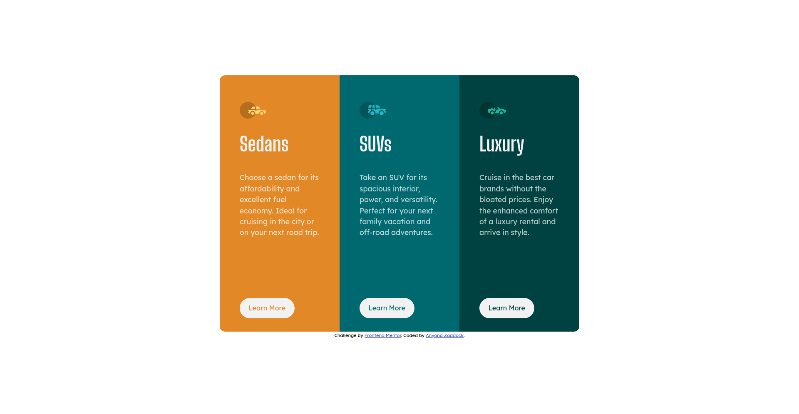

# Frontend Mentor - 3-column preview card component solution

This is a solution to the [3-column preview card component challenge on Frontend Mentor](https://www.frontendmentor.io/challenges/3column-preview-card-component-pH92eAR2-). Frontend Mentor challenges help you improve your coding skills by building realistic projects. 

## Table of contents

- [Frontend Mentor - 3-column preview card component solution](#frontend-mentor---3-column-preview-card-component-solution)
  - [Table of contents](#table-of-contents)
  - [Overview](#overview)
    - [The challenge](#the-challenge)
    - [Screenshot](#screenshot)
    - [Links](#links)
  - [My process](#my-process)
    - [Built with](#built-with)
    - [Continued development](#continued-development)
    - [Useful resources](#useful-resources)
  - [Author](#author)
  - [Acknowledgments](#acknowledgments)

## Overview

  It is great challenge for those delving into design using CSS. There are many ways to about the solution, thus, your creativity is your limit.

### The challenge

Users should be able to:

- View the optimal layout depending on their device's screen size
- See hover states for interactive elements

### Screenshot

### Links

- Solution URL: [GITHUB](https://github.com/zacc-anyona/3-column-preview-card--FRONTEND-MENTOR-CHALLENGE)
- Live Site URL: [VIEW USING NETLIFY](https://three-column-preview-card-anyona.netlify.app/)
- Live Site URL : [VIEW USING VERCEL](https://3-column-preview-card-frontend-mentor-challenge.vercel.app/)

## My process

  I used a mobile-first workflow.

### Built with

- Semantic HTML5 markup
- CSS custom properties
- Flexbox
- CSS Grid
- Mobile-first workflow

### Continued development

  It is my first time using CSS grid on a frontend mmentor challenge.

  I wanted to challenge myself by trying out something new like CSS grid. It was a bit challenging, I hope to get better with more practice.

### Useful resources

- [Example resource 1](https://www.youtube.com/watch?v=rg7Fvvl3taU&pp=ygUIZ3JpZCBjc3M%3D) - This helped youtube video by Kevin Powell helped to get upto speed with css grid.

## Author

- Frontend Mentor - [@zacc-anyona](https://www.frontendmentor.io/profile/zacc-anyona)
- Twitter - [@anyona_zadocc](https://www.twitter.com/anyona_zadocc).**

## Acknowledgments

I want to thank myself for completing this challenge to the end.

I want to thank Frontend Mentor for creating this challenge and making it available for everyone.
